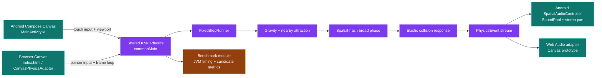

# Orbital Physics Engine

A visual-first orbital simulation for LearnCraft, built around a shared Kotlin Multiplatform physics core and platform-specific rendering adapters. The project combines a browser Canvas prototype, Jetpack Compose Android renderer, spatial audio, gravity wells, elastic collisions, drag interaction, and high-density spatial-hash simulation.

## Architecture at a glance

The repository keeps deterministic simulation rules in the shared KMP engine and leaves rendering, input, persistence, and audio to platform adapters. This separation lets Android Compose and browser Canvas consume the same physics behavior.



## What is included

| Layer | Location | Purpose |
|---|---|---|
| Browser prototype | `index.html` | Interactive Canvas scene with gravity wells, drag gestures, collisions, particles, adaptive quality, and Web Audio |
| Shared physics | `android/shared/src/commonMain` | Fixed-step integration, softened gravity, nearby attraction, uniform spatial hash, collision response, and physics events |
| Browser adapter | `android/shared/src/jsMain` | Connects the shared engine to an HTML Canvas and pointer events |
| Android renderer | `android/app` | Jetpack Compose Canvas rendering, touch-created wells, object settings, adaptive detail, and SoundPool audio |
| Benchmark | `android/benchmark` | JVM benchmark matrix from 100 to 5,000 bodies with median/p95 timing and broad-phase candidate counts |

## Core capabilities

The engine supports a central gravity field, finite gravity wells, per-object mass/radius/elasticity values, elastic collision response, mass-weighted positional correction, collision-event budgeting, spatial audio cues, and a capped fixed-step runner. Nearby attraction is restricted to spatial-hash neighbors so the active simulation avoids a global all-pairs force pass.

The visual system intentionally favors an exploratory space rather than a dashboard. Objects orbit a central learning core, can be dragged, and respond to wells with glow, burst, and audio feedback. The Android renderer uses level-of-detail limits for smaller viewports and larger scenes so touch responsiveness remains more important than rendering every background particle at maximum detail.

## Run the browser prototype

Serve the repository with any static HTTP server and open the resulting URL:

```bash
npx serve -l 4173 .
```

Audio begins only after the user enables it because browsers require a user gesture before an audio context can start.

## Build the Kotlin Multiplatform targets

The Android project expects JDK 17, Android SDK Platform 35, and Gradle 8.9 or newer. New contributors should first install Git, a JDK, the Android SDK command-line tools, Android SDK Platform 35, and the Android SDK Build Tools required by the selected Gradle/AGP version. Android Studio is recommended for emulator and Compose inspection, but command-line Gradle is sufficient for CI-style builds.

Clone the repository and enter the Android project:

```bash
git clone https://github.com/DevHuang1/orbital-physics-engine.git
cd orbital-physics-engine/android
```

If the repository contains a Gradle wrapper in your checkout, make it executable and use it consistently. If a wrapper is not present, install Gradle 8.9 or newer and confirm the toolchain:

```bash
java -version
gradle --version
adb version
```

Run the shared tests and compile each target before making changes:

```bash
./gradlew :shared:allTests
gradle :shared:jsBrowserProductionWebpack
gradle :app:assembleDebug
gradle :benchmark:run
```

For local browser work, the root prototype has no bundler requirement. From the repository root, serve it with a static server:

```bash
npx serve -l 4173 .
```

Then open `http://localhost:4173`. Browser audio must be enabled through the interface after a user gesture. For Android iteration, open the `android` directory in Android Studio, select the `app` configuration, attach an emulator or physical device, and run the debug target. The benchmark is JVM-side and should be compared with physical-device frame profiling rather than treated as an Android frame-time guarantee.

A contributor's first validation pass should be:

```bash
cd ..
git diff --check
./scripts/run-benchmarks.sh
```

The current sandbox does not include the Gradle wrapper or Android SDK, so Android and Kotlin compilation should be run on a development machine with the stated toolchain.

## Run benchmarks

The benchmark suite performs 120 warm-up steps and 600 measured fixed steps for each body count. It prints CSV columns for body count, median step time, p95 step time, spatial-hash candidate pairs, and resolved collisions.

```bash
./scripts/run-benchmarks.sh
```

See [`BENCHMARKS.md`](BENCHMARKS.md) for measurement guidance and interpretation. See [`KMP_ARCHITECTURE.md`](KMP_ARCHITECTURE.md) for the shared-module design and platform boundaries.

## Repository status

This is an active engineering prototype. The browser prototype is directly runnable; Android/KMP source is organized for compilation on a machine with the required Kotlin, Gradle, and Android toolchain. Benchmark numbers should always be collected on the target device or a documented reference machine rather than inferred from source inspection.

## Automated Android releases and Samsung downloads

The browser prototype opens directly on Samsung Chrome, while the native Android target can be downloaded as a signed APK. Configure the repository secrets documented in [`android/README.md`](android/README.md), then push a version tag such as `v1.0.2` to trigger a signed release automatically. Download `app-release.apk` from the GitHub release, open it on the phone, and allow installation from the file source if Android asks. The control panel shows the installed build version and version code.

The full Android setup, local build commands, and troubleshooting notes are in [`android/README.md`](android/README.md). See [`docs/RELEASING.md`](docs/RELEASING.md) for the exact tag-publishing routine and version-code policy.
